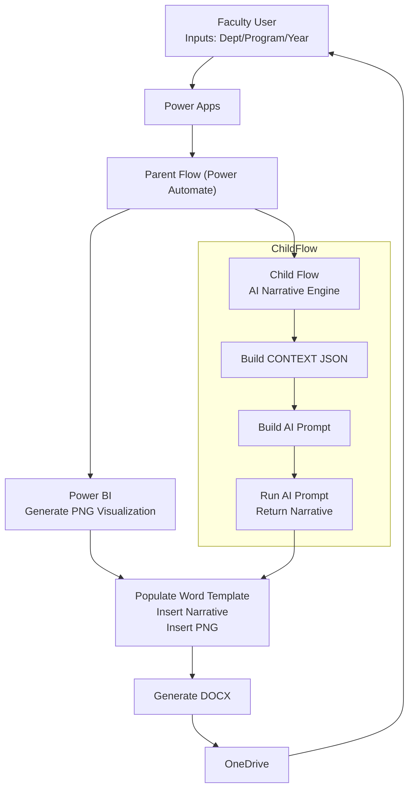

# AEDIS_REPORT – Automated Academic Reporting System (GenAI + Power BI)
A fully automated academic reporting system that combines Generative AI, Power BI analytics, and Microsoft Power Automate to generate professional, data-driven assessment reports with minimal manual effort.

This system converts raw performance data into narrative insights, embeds Power BI visualizations, and produces a formatted Word report using a structured template.
Designed as a scalable, maintainable framework for future students to extend and build upon.

### System Requirements

### Microsoft 365 Prerequisites

This project uses premium connectors:
| **Feature**               | **Requirement** |
|--------------------------|-----------------|
| Populate Word Template   | Requires Power Automate Premium or M365 E5 |
| AI Prompt Execution      | Run a prompt action |
| Power BI Image Export    | Power BI Pro |
| Cloud Flows              | Power Automate |

Without a premium license, the flow will NOT run.

### Core System Components
### 1. Word Template Architecture (de_report_Template.docx)

The template defines the output layout.
Static headings (bold, numbered) are manually placed:
- 12.1 Courses Performing Well
- 12.2 Courses Needing Support (with targeted actions)
- 12.3 Trends

Content is inserted using content controls:

| Tag     | Type       | Purpose                               |
| ------- | ---------- | ------------------------------------- |
| AP      | Plain Text | Narrative for Courses Performing Well |
| AP1     | Plain Text | Narrative for Courses Needing Support |
| AP2     | Plain Text | Narrative for Trends                  |
| pb      | Picture    | Power BI visualization export         |

### 2. AI Narrative Generation Logic

The child flow (AI_Final) generates narrative text using Generative AI.

AI output is structured using delimiters:
- ===COURSES_PERFORMING_WELL===
- ===COURSES_NEEDING_SUPPORT===
- ===TRENDS===

Narrative Rules:

- Third-person academic tone
- Past tense
- Accreditation style (SACSCOC-like)
- Bullet points allowed
- No invented values
- No headings (Word controls headings)

### 3. Power BI Visualization Integration (PNG)

A Power BI visual is exported as PNG and inserted through the pb picture control.

Workflow:

- Power BI → PNG export

- Save to OneDrive

- Parent flow loads PNG

- Populate Word Template inserts PNG into pb

This ensures the final report includes the correct visual.

### 4. Flow Architecture
Parent Flow: AEDIS_Report_Builder_Tokens_V2

Responsibilities:

- Receive inputs (department, year, program)

- Load Power BI PNG

- Call AI_Final child flow

- Split AI text into 3 sections

- Populate Word template

- Save DOCX and generate share link

- Child Flow: AI_Final

Responsibilities:

- Build CONTEXT JSON

- Build AI prompt

- Execute “Run a Prompt”

- Return single combined narrative string

### 5. Section Splitting Logic (Power Automate)

- The AI returns one long text block containing all of Section 12.
- This text contains three delimiter markers:
  - `===COURSES_PERFORMING_WELL===`
  - `===COURSES_NEEDING_SUPPORT===`
  - `===TRENDS===`
- The flow searches for each marker and extracts the text that appears after it.
- Each extracted portion is assigned to:
  - **12.1 Courses Performing Well**
  - **12.2 Courses Needing Support**
  - **12.3 Trends**
- These parts are injected into the Word template using the content controls:
  - `AP`
  - `AP1`
  - `AP2`

### 6. Output Formatting Notes

Formatting is controlled by Word, NOT Power Automate.

- Paragraph spacing
- Alignment
- Bullet structure
- Heading bold style

If formatting looks wrong, fix the template, not the flow.

### 7. How to Import the Cloud Flows

1. Go to Power Automate → Solutions → Import
2. Upload AEDIS_5_6_7_25_managed.zip

3. Reconnect these connectors:
 - OneDrive

 - Word Online (Business)

 - AI Builder

 - Power BI

4. Update file paths in the flow:

 - Template path

 - PNG file path

 - Output folder path

### 8. How to Extend the System
- Add new report sections

- Add new delimiter to AI prompt

- Add new Compose step for splitting

- Add new content control to Word template

- Map inside Populate Word Template

- Change AI writing style

- Modify the cmpPromptText block in child flow.

- Change formatting

- Edit the .docx template only.

### 9. Architecture Diagram

### 10. Licensing Note

Populate Word Template is a PREMIUM connector
You MUST have:

Power Automate Premium
OR

Microsoft 365 E5/A5

This is required for the automation to work.

### 11. Developer & Faculty Info

Developer: Bhuvaneshwari Bodakuntla

MS-DSE, Auburn University

Faculty Advisor: Dr. Xiao Qin
